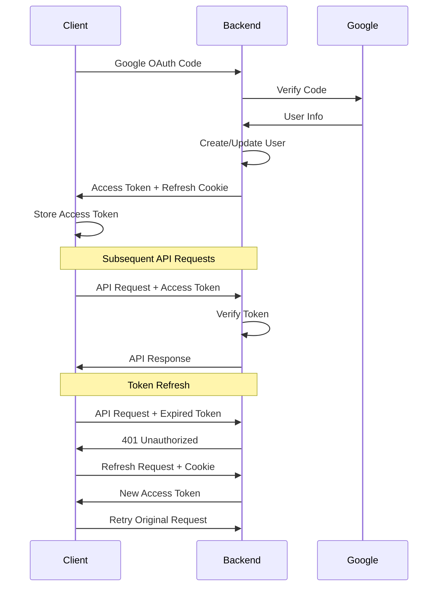

# Finance Tracker - Technical Documentation

## Table of Contents

1. [Architecture Overview](#architecture-overview)
2. [Database Schema](#database-schema)
3. [API Reference](#api-reference)
4. [Frontend Components](#frontend-components)
5. [Authentication Flow](#authentication-flow)
6. [State Management](#state-management)
7. [Development Guide](#development-guide)
8. [Security Considerations](#security-considerations)

## Architecture Overview

Finance Tracker follows a modern full-stack architecture with clear separation between frontend and backend concerns.

### System Architecture

```
┌─────────────────┐    ┌─────────────────┐    ┌─────────────────┐
│   React Client  │────│  Express API    │────│   MongoDB       │
│   (Frontend)    │    │   (Backend)     │    │   (Database)    │
└─────────────────┘    └─────────────────┘    └─────────────────┘
         │                       │                       │
         │                       │                       │
    ┌─────────┐             ┌─────────┐             ┌─────────┐
    │ SWR     │             │ JWT     │             │ Mongoose│
    │ Caching │             │ Auth    │             │ ODM     │
    └─────────┘             └─────────┘             └─────────┘
         │                       │
    ┌─────────┐             ┌─────────┐
    │ Tailwind│             │ Gemini  │
    │ CSS     │             │ AI      │
    └─────────┘             └─────────┘
```

### Technology Stack Details

#### Frontend Dependencies

```json
{
  "react": "^18.2.0",
  "vite": "^4.4.5",
  "tailwindcss": "^3.3.3",
  "swr": "^2.2.0",
  "recharts": "^2.7.2",
  "lucide-react": "^0.263.1",
  "framer-motion": "^10.16.0",
  "react-hot-toast": "^2.4.1"
}
```

#### Backend Dependencies

```json
{
  "express": "^4.18.2",
  "mongoose": "^7.5.0",
  "jsonwebtoken": "^9.0.2",
  "cookie-parser": "^1.4.6",
  "cors": "^2.8.5",
  "@google/generative-ai": "^0.1.0",
  "dotenv": "^16.3.1"
}
```

## Database Schema

### User Model

```javascript
{
  _id: ObjectId,
  googleId: String, // Unique identifier from Google OAuth
  name: String,
  email: String,
  avatar: String, // Profile picture URL
  createdAt: Date,
  updatedAt: Date
}
```

### Transaction Model

```javascript
{
  _id: ObjectId,
  user: ObjectId, // Reference to User
  amount: Number, // Transaction amount (positive for all transactions)
  currency: String, // Default: "USD"
  category: String, // e.g., "Food", "Transport", "Income"
  description: String, // Transaction description
  date: Date, // Transaction date
  rawText: String, // Original input text (for AI parsing)
  createdAt: Date,
  updatedAt: Date
}
```

## API Reference

### Base URL

```
http://localhost:5000
```

### Authentication Endpoints

#### POST /auth/google

**Purpose**: Authenticate user with Google OAuth code

```javascript
// Request Body
{
  code: "4/P7q7W91a-oMsCeLvIaQm6bTrgtp7" // Google OAuth code
}

// Response
{
  success: true,
  data: {
    accessToken: "eyJhbGciOiJIUzI1NiIsInR5cCI6IkpXVCJ9...",
    user: {
      _id: "648b482dfd9d9ebbf86dbba90",
      name: "John Doe",
      email: "john@example.com"
    }
  }
}
```

#### POST /auth/refresh

**Purpose**: Refresh expired access token

```javascript
// Headers: Cookie with refresh token required
// Response
{
  success: true,
  data: {
    accessToken: "new_access_token"
  }
}
```

#### GET /auth/profile

**Purpose**: Get current user profile

```javascript
// Headers: Authorization: Bearer <token>
// Response
{
  success: true,
  data: {
    _id: "648b482dfd9d9ebbf86dbba90",
    name: "John Doe",
    email: "john@example.com"
  }
}
```

### Transaction Endpoints

#### GET /api/transactions

**Purpose**: Get all user transactions

```javascript
// Headers: Authorization: Bearer <token>
// Response
{
  success: true,
  transactions: [
    {
      _id: "648b4bdcdfbaaa90186da7ce0",
      amount: 20,
      category: "Food",
      description: "Starbucks coffee",
      currency: "USD",
      date: "2025-08-31T21:25:33.275Z",
      user: "648b482dfd9d9ebbf86dbba90"
    }
  ]
}
```

#### POST /api/transactions

**Purpose**: Create new transaction

```javascript
// Request Body
{
  amount: 25.50,
  category: "Food",
  description: "Lunch at restaurant",
  currency: "USD",
  date: "2025-08-31T12:00:00.000Z"
}

// Response
{
  success: true,
  message: "Transaction added successfully",
  transaction: { /* created transaction object */ }
}
```

#### POST /api/transactions/parse

**Purpose**: Parse transaction text using AI

```javascript
// Request Body
{
  text: "Coffee at Starbucks $6.50"
}

// Response
{
  success: true,
  parsed: {
    amount: 6.50,
    category: "Food",
    description: "Coffee at Starbucks",
    currency: "USD",
    confidence: 0.95
  }
}
```

### Analytics Endpoints

#### GET /api/analytics/summary

**Purpose**: Get financial summary

```javascript
// Response
{
  success: true,
  summary: {
    income: 5000,
    expenses: 3500,
    savings: 1500
  }
}
```

#### GET /api/analytics/categories

**Purpose**: Get spending by category

```javascript
// Response
{
  success: true,
  categories: [
    {
      category: "Food",
      amount: 450
    },
    {
      category: "Transport",
      amount: 200
    }
  ]
}
```

## Frontend Components

### Component Hierarchy

```
App
├── ThemeProvider
├── AuthProvider
└── Router
    ├── LoginPage
    └── DashboardPage
        ├── FiltersBar
        ├── SummaryCards
        ├── Charts
        │   ├── PieChart (Categories)
        │   └── LineChart (Trends)
        ├── AddTransactionDialog
        └── TransactionsList
            ├── TransactionRow
            └── EditTransactionDialog
```

### Key Components

#### AuthContext

```javascript
// Provides authentication state and methods
const AuthProvider = ({ children }) => {
  const [user, setUser] = useState(null);
  const [accessToken, setAccessToken] = useState(null);
  const [loading, setLoading] = useState(true);

  // Methods: loginWithGoogle, logout, getProfile
  // Auto-refresh token on expiration
};
```

#### ThemeContext

```javascript
// Manages dark/light theme state
const ThemeProvider = ({ children }) => {
  const [theme, setTheme] = useState("system");

  // Automatically applies theme classes to document
  // Persists theme choice in localStorage
};
```

#### Dashboard Hooks

```javascript
// SWR hooks for data fetching
function useSummary(api, isAuthenticated) {
  /* ... */
}
function useCategories(api, isAuthenticated) {
  /* ... */
}
function useTrends(period, api, isAuthenticated) {
  /* ... */
}
function useTransactions(api, isAuthenticated) {
  /* ... */
}
```

## Authentication Flow

### JWT Token Strategy

1. **Access Token**: Short-lived (15 minutes), used for API requests
2. **Refresh Token**: Long-lived (7 days), httpOnly cookie, used to refresh access tokens

### Authentication Sequence



## State Management

### SWR Configuration

```javascript
// Global SWR configuration
const swrConfig = {
  errorRetryCount: 1,
  errorRetryInterval: 2000,
  revalidateOnFocus: false,
  revalidateOnReconnect: true,
};

// Cache keys follow RESTful patterns
const keys = {
  transactions: "api/transactions",
  summary: "api/analytics/summary",
  categories: "api/analytics/categories",
  trends: (period) => `api/analytics/trends?period=${period}`,
};
```

### Optimistic Updates

```javascript
// Example: Delete transaction with optimistic update
const deleteTransaction = async (id) => {
  // Immediately update UI
  mutate(key, (current) => current.filter((t) => t._id !== id), {
    revalidate: false,
  });

  try {
    await api.delete(`/api/transactions/${id}`);
    mutate(key); // Revalidate from server
  } catch (error) {
    mutate(key); // Revert on error
    throw error;
  }
};
```

## Development Guide

### Frontend Development

```bash
# Start development server
cd frontend
npm run dev

# Build for production
npm run build

# Preview production build
npm run preview
```

### Backend Development

```bash
# Start development server with nodemon
cd backend
npm run dev

# Start production server
npm start
```

### Code Structure

#### Frontend Structure

```
/frontend/src/
├── components/          # Reusable UI components
│   ├── ui/             # ShadCN UI components
│   ├── AddTransactionDialog.jsx
│   ├── EditTransactionDialog.jsx
│   ├── TransactionsList.jsx
│   └── ...
├── context/            # React contexts
│   ├── AuthContext.jsx
│   └── ThemeContext.jsx
├── lib/                # Utilities
│   ├── format.js       # Date/currency formatting
│   └── utils.js        # General utilities
├── pages/              # Page components
│   ├── Dashboard.jsx
│   └── Login.jsx
└── App.jsx
```

#### Backend Structure

```
/backend/
├── config/             # Configuration files
│   └── db.js          # Database connection
├── middlewares/        # Express middlewares
│   └── auth.js        # JWT authentication
├── models/            # Mongoose models
│   ├── User.js
│   └── Transaction.js
├── routes/            # API routes
│   ├── auth.js        # Authentication routes
│   ├── transaction.js # Transaction CRUD
│   └── analytics.js   # Analytics endpoints
└── server.js          # Express app entry point
```

## Security Considerations

### Authentication Security

- JWT access tokens have short expiration (15 minutes)
- Refresh tokens are httpOnly cookies (XSS protection)
- Google OAuth provides secure user authentication
- User authorization checks on all protected routes

### API Security

- CORS configured for specific origins
- Request rate limiting (recommended for production)
- Input validation and sanitization
- MongoDB injection protection via Mongoose

### Frontend Security

- Environment variables prefixed with `VITE_` for client exposure control
- XSS protection through React's built-in escaping
- HTTPS required for production (Google OAuth requirement)

### Data Privacy

- User data stored securely in MongoDB
- No sensitive financial data exposed in logs
- Google OAuth scopes limited to profile information

### Production Recommendations

```javascript
// Additional security headers
app.use(helmet());

// Rate limiting
app.use(
  rateLimit({
    windowMs: 15 * 60 * 1000, // 15 minutes
    max: 100, // limit each IP to 100 requests per windowMs
  })
);

// Input validation
app.use("/api", validation.middleware);
```

## Performance Optimizations

### Frontend

- SWR for efficient data fetching and caching
- Memoization for expensive calculations
- Optimistic updates for better UX

### Backend

- Database indexes for common queries
- Aggregation pipelines for analytics
- Connection pooling for MongoDB
- Caching strategies for frequently accessed data
